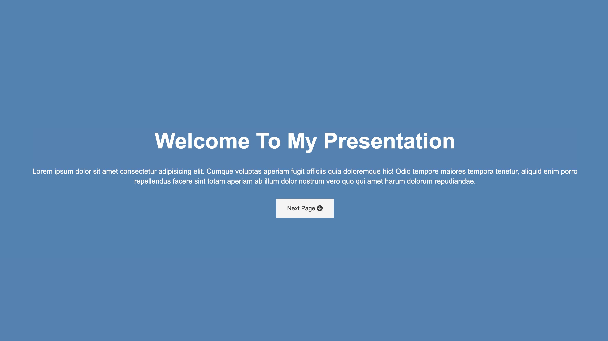

# Presentation Website (UI mastery series 3 of 6)

## Description

This project is the third in a six part series I've created to really master my UI development skills. For this project, I've built a beautiful website that mimics presentation slides with css animations.

## Screenshot of Deployed Application

## Deployed Application

https://osamadahnoun.github.io/Presentation-Website/

## Contribution

Made with love by Osama Dahnoun ❤️
